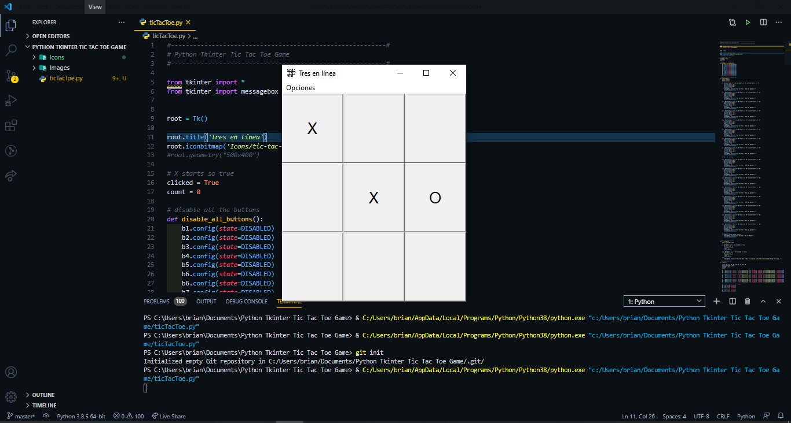
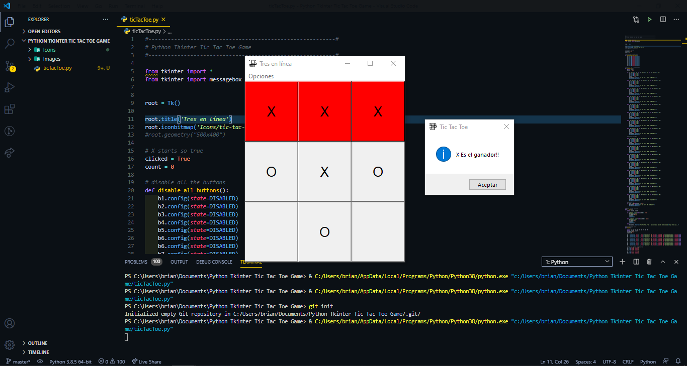

<h2 align="center">Tres en Linea &nbsp; 🎮 &nbsp;</h2>

  
  
  
  
  
  

  
 
 El tres en línea, también conocido como Ceros y Cruces, tres en raya (España, Ecuador y Bolivia), Michi (en Perú), Triqui (en Colombia), Cuadritos, juego del gato, Gato (en Chile, Costa Rica y México), Tatetí (en Argentina, Paraguay y Uruguay), Totito (en Guatemala), Triqui traka, Equis Cero, Tic-Tac-Toe (en Estados Unidos), o la vieja (en Venezuela), es un juego de lápiz y papel entre dos jugadores: O y X, que marcan los espacios de un tablero de 3×3 alternadamente. 
 

